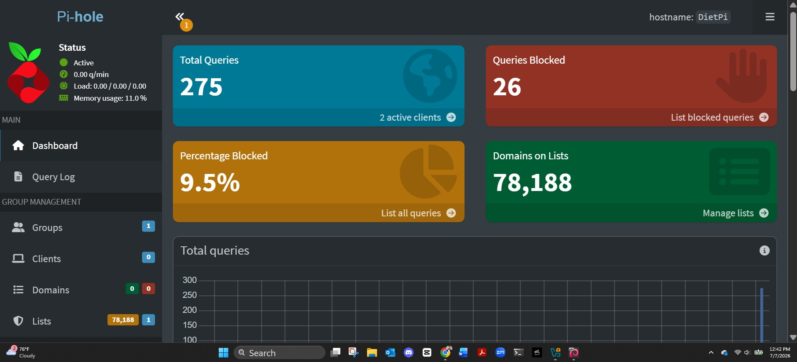
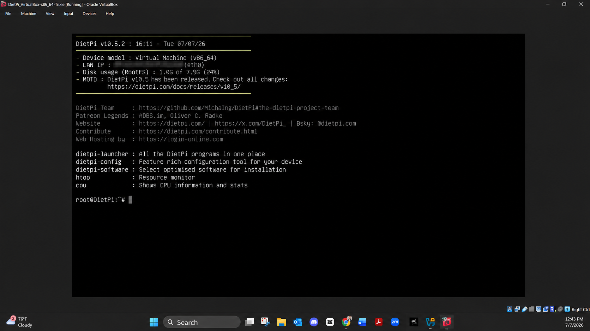
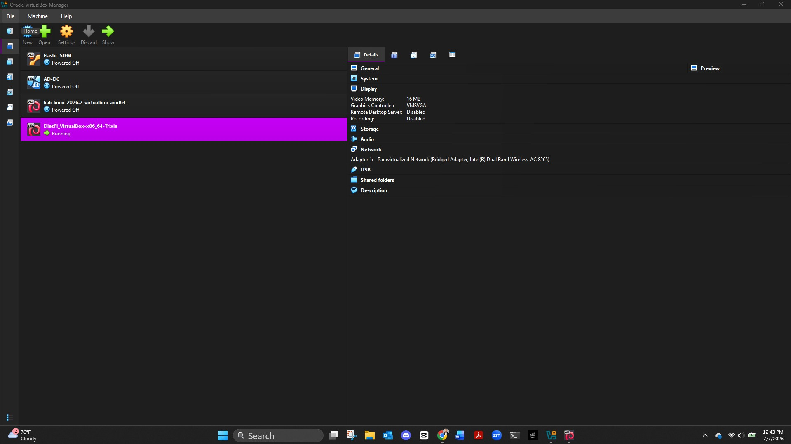

# Pi-hole Network DNS Filtering Lab

Self-hosted network-wide DNS filter built on DietPi and VirtualBox. Validated Pi-hole as a concept before committing to a Raspberry Pi 4 for permanent deployment.

---

## The Problem

Not everything worth watching is on a major streaming platform. Finding content elsewhere means dealing with aggressive ad delivery on every click: popups, redirects, and injected scripts. As someone studying threat actor behavior, I know exactly what those redirects can lead to. I wanted a network-level fix I controlled entirely, with zero reliance on browser extensions or per-device configuration.

Pi-hole solves this at the DNS layer. Before a single ad request resolves, it is already blocked.

---

## Architecture

```
Home Network
│
├── Router (DNS set to Pi-hole static IP)
│
├── DietPi VM (VirtualBox, Bridged Adapter)
│   └── Pi-hole
│       ├── Upstream: Cloudflare 1.1.1.1 (DNSSEC)
│       ├── Blocklist: StevenBlack Unified Hosts List
│       └── Web UI: port 8089
│
├── Windows host (DNS manually set to Pi-hole)
└── iPhone (Wi-Fi DNS manually set to Pi-hole)
```

---

## Stack

| Component | Detail |
|---|---|
| OS | DietPi (Debian-based, VirtualBox OVA) |
| Hypervisor | Oracle VirtualBox |
| Network mode | Bridged Adapter, Promiscuous Mode: Allow All |
| DNS filter | Pi-hole v6 |
| Upstream DNS | Cloudflare 1.1.1.1 with DNSSEC |
| Blocklist | StevenBlack Unified Hosts List |
| Static IP | Locked via DietPi-Config before Pi-hole install |
| Web UI | http://[pihole-host]:8089/admin |

---

## Setup Steps

### 1. Import DietPi into VirtualBox

Download the DietPi VirtualBox OVA from [dietpi.com](https://dietpi.com/#download) under PC/VM.

In VirtualBox: File → Import Appliance → select the .ova → Import.

### 2. Configure Network Adapter

Before starting the VM:

- Settings → Network → Adapter 1
- Attached to: Bridged Adapter
- Name: your active network adapter
- Promiscuous Mode: Allow All

This gives the VM a real LAN IP from your router, which is required for Pi-hole to function as a network-wide DNS server.

### 3. First Boot and Initial Setup

Boot the VM. DietPi runs a first-boot configuration wizard automatically:

- Disable IPv6 when prompted (avoids connectivity check failures)
- Set keyboard layout to US
- Set a password for root and dietpi accounts
- Let the update check complete

### 4. Lock Static IP

Pi-hole requires a static IP to function reliably as a DNS server.

In the DietPi Software menu:

```
dietpi-config → Network Options → Ethernet → Change Mode: STATIC → Copy current address to Static → Apply
```

Confirm the IP is locked before proceeding.

### 5. Install Pi-hole

In the DietPi Software menu:

```
dietpi-software → Browse Software → DNS Servers → Pi-hole (item 93) → Space to select → Confirm → Ok
```

When prompted:

- Unbound: Skip (adds complexity, not needed for initial validation)
- Upstream DNS: Cloudflare (DNSSEC)
- Blocklist: Yes (StevenBlack Unified Hosts List)
- Privacy mode: Show everything (full visibility for lab purposes)

### 6. Set Static IP on Client Devices

**Windows:**

Control Panel → Network Connections → Wi-Fi → Properties → IPv4 → Use the following DNS server → enter Pi-hole host IP

**iPhone:**

Settings → Wi-Fi → tap (i) next to network → Configure DNS → Manual → delete existing entries → Add Server → enter Pi-hole host IP → Save

---

## Results

| Metric | Value |
|---|---|
| Domains on blocklist | 78,188 |
| Active clients tested | 2 (Windows + iPhone) |
| Percentage blocked (initial traffic sample) | 9.5% |
| Status | Active |

---

## Screenshots

### Pi-hole Dashboard


### DietPi Terminal (Post-Install)


### VirtualBox Setup


---

## Key Findings

**What Pi-hole blocks well:**
- Ad network domains resolved through standard DNS
- Tracking and telemetry domains across all devices simultaneously
- Known malware and phishing domains on the blocklist

**What Pi-hole does not block:**
- Ads served from the same domain as the content (same-origin ads)
- Apps that hardcode IP addresses instead of domain names
- DNS-over-HTTPS traffic that bypasses system DNS settings entirely

**The unexpected finding:**

The query log is not just an ad blocker. Every domain every device on the network touches is logged in real time. That is a passive DNS telemetry layer sitting on the home network. IOCs from threat intelligence reports like the 2025 CrowdStrike Global Threat Report map directly onto what you can hunt in that log. This observation shaped the next project.

---

## Threat Hunting Angle

Pi-hole's query log is a viable source for DNS-based threat hunting at the home lab level. Planned next steps:

- Pull Pi-hole DNS logs
- Cross-reference against IOC feeds from 2025 CrowdStrike Global Threat Report and Mandiant M-Trends
- Identify suspicious domains, beaconing patterns, and anomalous query volumes
- Document findings in a structured Threat Hunting Report

---

## Next Step: Raspberry Pi 4

The VM validated the concept. Limitations of the VM setup:

- Pi-hole only runs when the host PC is on
- WiFi bridging in VirtualBox requires specific adapter and promiscuous mode support
- Not suitable for 24/7 network-wide coverage

A Raspberry Pi 4 on ethernet solves all three. DietPi runs identically on Pi hardware. Setup time: under 30 minutes. Power draw: approximately 3 watts at idle.

---

## Related Projects

- [AD Identity Attack Detection Lab](https://github.com/shahoahmed/ad-identity-attack-detection-lab) - Elastic SIEM, custom Kerberoasting KQL detection rule, Python Isolation Forest alert scorer, local Llama 3.2 LLM triage via Ollama

---
[LinkedIn](https://www.linkedin.com/in/shaho-ahmed) | [GitHub](https://github.com/shahoahmed)
